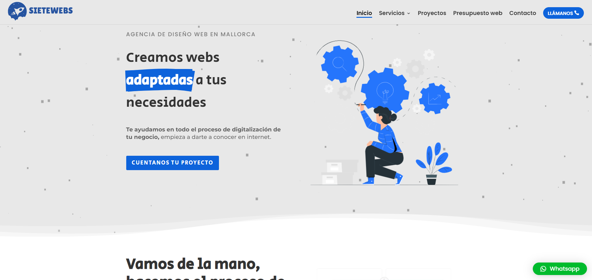
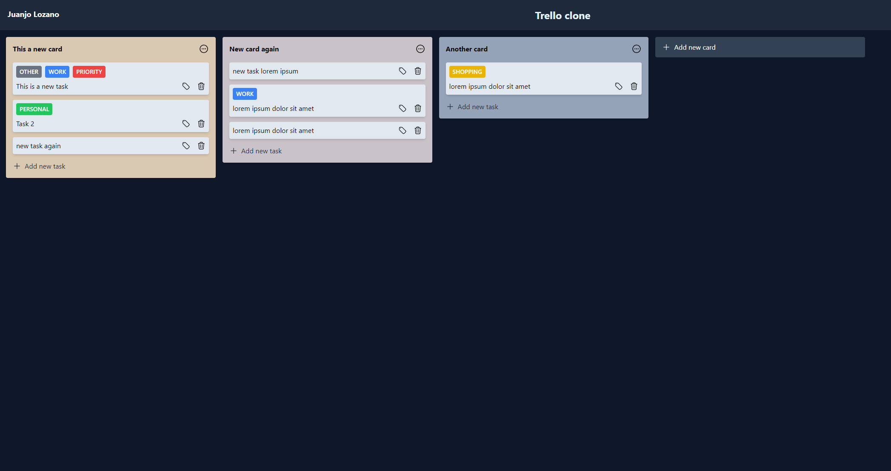
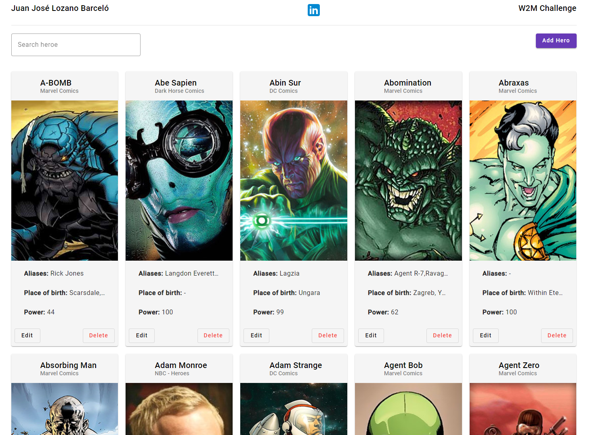
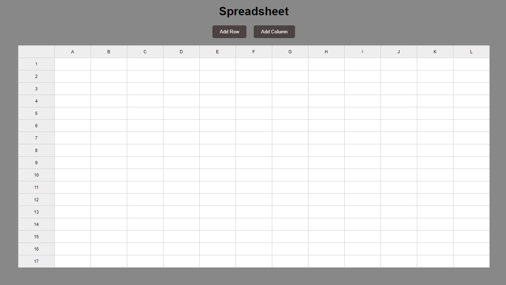
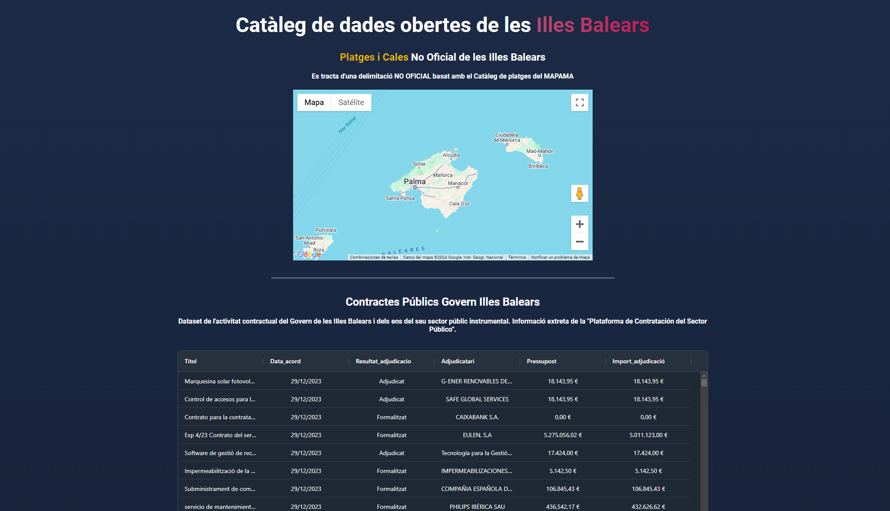

   
   <h3 align="center">¡Hey 👋! I am Juanjo 👨🏻‍💻</h3>

I am a <strong>javascript front end developer</strong> with more than 4 years of experience, currently working at RIU Hotels & Resorts.

## 🏆Projects

<table border="0" align="center">
   <tr>
      <td style='text-align:center;' width="400">
         
      </td>
      <td style='text-align:center;' width="400">
          
      </td>
      <td style='text-align:center;' width="400">
          
      </td>
   </tr>
   <tr>
      <td style='text-align:center; vertical-align:middle'>
         <h3>SIETEWEBS</h3>
      </td>
      <td style='text-align:center; vertical-align:middle'>
            <h3>TRELLO CLONE</h3>
      </td>
      <td style='text-align:center; vertical-align:middle'>
            <h3>ANGULAR CHALLENGE</h3>
      </td>
   </tr>
   <tr>
      <td style='text-align:center; vertical-align:middle'>
         <a href="https://sietewebs.es" style="display: block;">https://sietewebs.es</a>
      </td>
      <td style='text-align:center; vertical-align:middle'>
         <a href="https://juanjolb.github.io/trello-clone-angular" style="display: block;">Trello clone github pages</a>
      </td>
      <td style='text-align:center; vertical-align:middle'>
         <a href="https://github.com/juanjolb/w2m-challenge" style="display: block;">Challenge repository</a>
      </td>
      
   </tr>
   <tr>
      <td style='text-align:center; vertical-align:middle'>
         
My work as a freelance, I have designed, developed and deployed websites to multiple clients using CMS like wordpress or custom developments with the latest technologies.

      </td>
      <td style='text-align:center; vertical-align:middle'>
         
Trello clone using Angular version 17 new features, card data is stored in localstorage, with drag and drop features to card and tasks.

      </td>
      <td style='text-align:center; vertical-align:middle'>
         
CRUD of Heroes using Angular with http requests (mocked backend), interceptor, API pagination, custom directive, routing and more.

      </td>
   </tr>
</table>

<table border="0" align="center">
   <tr>
      <td style='text-align:center;' width="400">
         
      </td>
      <td style='text-align:center;' width="400">
          
      </td>
   </tr>
   <tr>
      <td style='text-align:center; vertical-align:middle'>
         <h3>SPREADSHEET</h3>
      </td>
      <td style='text-align:center; vertical-align:middle'>
            <h3>BALEARIC ISLANDS PUBLIC DATA</h3>
      </td>
   </tr>
   <tr>
      <td style='text-align:center; vertical-align:middle'>
         <a href="https://juanjolb.github.io/midu-spreadsheet/" style="display: block;">Spreadsheet github pages</a>
      </td>
      <td style='text-align:center; vertical-align:middle'>
         <a href="https://juanjolb.github.io/public-data-ib/" style="display: block;">B.I data github pages</a>
      </td>
      
   </tr>
   <tr>
      <td style='text-align:center; vertical-align:middle'>
         
Spreadsheet based on @midudev exercise, with a plain html file just using JS.

      </td>
      <td style='text-align:center; vertical-align:middle'>
         
Open data catalogue of the Balearic Islands, with a map and tables of multiple data obtained from the Open Data Portal GOIB

      </td>
   </tr>
</table>

## ⚡Skills

   
   
   
   
   
   
   
   

## 💬 Contact

   
   

